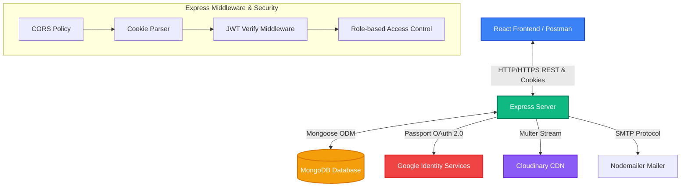

# 🌐 Elite Story Blog App — Backend API Service

[](https://nodejs.org/)
[](https://expressjs.com/)
[](https://mongodb.com/)
[](https://opensource.org/licenses/ISC)

Welcome to the backend API service for **Elite Story**, a secure, premium, and feature-rich blog platform built on the **MERN (MongoDB, Express, React, Node.js)** stack. This server handles enterprise-grade authentication, role-based authorization, media gallery storage via Cloudinary, and high-performance REST endpoints.

---

## 🗺️ System Architecture & Data Flow

Below is the conceptual architecture of how the Elite Story client interacts with this backend service:



---

## ✨ Features

- **🔐 Dual Authentication Systems**:
  - **Traditional Auth**: Hashed passwords (via `bcrypt` with salt rounds of 10), email verification logic, and cookie-based JWT transmission.
  - **Google Federated Login**: Passport.js Integration (`passport-google-oauth20`) that updates or creates profile records seamlessly with automated redirection.
- **🛡️ JWT Role-Based Authorization**:
  - Granular validation middleware supporting three main user personas: `USER` (Readers/Subscribers), `AUTHOR` (Creators), and `ADMIN` (Site Managers).
  - Secure HTTP-only cookies prevent Cross-Site Scripting (XSS) token extraction.
- **🖼️ Premium Media Handling**:
  - Fully integrated image upload pipelines using `Multer` memory storage buffers and `Cloudinary` SDK.
  - Supports uploading user profile avatars as well as full-featured article cover images and interactive inner galleries.
- **📝 High-Fidelity Blog Management**:
  - Authors can create, edit, restore, soft-delete, and update article covers.
  - Interactive media gallery operations: dynamic gallery image insertions, single replaces, and removals.
- **💬 Community Interactions & Moderation**:
  - Threaded comment systems showing author identity badges and role status.
  - Moderated comment deletion allowing universal testing and robust cleanup actions.
- **✉️ Password Recovery Pipeline**:
  - Integrated SMTP transporter using `Nodemailer` for secure, beautiful HTML email templates containing time-sensitive reset tokens (1-hour expiration).

---

## 📂 Backend Directory Structure

The project conforms to a clean, decoupled MVC/service-oriented layer structure:

```text
d:\Blogapp/
├── APIs/                   # Express Router modules (REST API Layer)
│   ├── AdminAPI.js         # User blocking/unblocking and management
│   ├── AuthorAPI.js        # Article creations, gallery management, and analytics
│   ├── CommonAPI.js        # Logins, logouts, session checks, and profile modifications
│   └── userAPI.js          # Article reading, comments operations, and purchases
├── Models/                 # Mongoose Database Schemas & Models
│   ├── UserModel.js        # User identities, Google OAuth logs, and purchase arrays
│   ├── ArticleModel.js     # Article contents, views counters, and comments sub-documents
│   └── AdminModel.js       # Administrative models (Reserved for extensions)
├── config/                 # Service & Integrations Configuration
│   ├── cloudinary.js       # Cloudinary client connection
│   ├── cloudinaryUpload.js # Cloudinary stream buffers uploader helper
│   ├── multer.js           # Multer parser config (disk-free, memory-buffer only)
│   └── passport.js         # Google Strategy and serialization strategies
├── middlewares/            # Express request pipelines
│   ├── checkauthor.js      # Custom verified author validation check
│   └── verifyTokens.js     # Role verification & JWT extraction
├── services/               # Core business services layer
│   └── authService.js      # Password registrations and logins validation
├── utils/                  # Core helpers and auxiliary packages
│   └── emailService.js     # SMTP Nodemailer templates & reset dispatchers
├── .env                    # Node environment configuration (Git-ignored)
├── package.json            # NPM dependencies & manifest
├── req.http                # REST client playground file
└── server.js               # Application Entry Point & Database connection
```

---

## 🗄️ Database Schemas

### 👤 User Schema (`UserModel.js`)
| Field | Type | Description |
| :--- | :--- | :--- |
| `firstName` | `String` | **Required**. User's first name. |
| `lastName` | `String` | Optional. User's family name. |
| `email` | `String` | **Required, Unique, Lowercase**. Registered email account. |
| `googleId` | `String` | Google Unique Profile Identifier (for Federated Login). |
| `password` | `String` | **Conditional**. Required *only* if `googleId` is absent. |
| `profileImageUrl`| `String` | Cloudinary URL for the profile avatar. |
| `role` | `String` | **Enum**: `USER`, `AUTHOR`, `ADMIN`. Defaults to `USER`. |
| `isActive` | `Boolean` | User status. Blocked users lose write/read access. |
| `purchasedArticles`| `[ObjectId]` | Array of Article ObjectIDs purchased by the user (Premium access). |

### 📝 Article Schema (`ArticleModel.js`)
| Field | Type | Description |
| :--- | :--- | :--- |
| `author` | `ObjectId` | **Required**. Reference to `user` (Author's ID). |
| `title` | `String` | **Required**. Headline of the article. |
| `category` | `String` | **Required**. Categorization label (e.g., Tech, Lifestyle). |
| `content` | `String` | **Required**. Core content (supports Markdown/Rich Text HTML). |
| `comments` | `[CommentSchema]`| Array of comment sub-documents containing `{ user, comment }`. |
| `ArticleImage` | `String` | Cover image Cloudinary URL. |
| `images` | `[String]` | Array of Cloudinary URLs representing the inner story gallery. |
| `views` | `Number` | View counter increments automatically upon reads. |
| `isPremium` | `Boolean` | Flag indicating whether the article requires purchase. |
| `isArticleActive`| `Boolean` | Core flag for soft deletes. Soft-deleted posts are ignored in main feeds. |

---

## 🛣️ API Endpoints Index

### 🔓 Public / Shared Access (`CommonAPI.js` & Google OAuth)
| Method | Path | JWT Auth | Payload / Parameters | Description |
| :---: | :--- | :---: | :--- | :--- |
| `GET` | `/auth/google` | ❌ | *None* | Triggers Passport Google OAuth workflow |
| `GET` | `/auth/google/callback`| ❌ | *None* | Google callback. Redirects with JWT Cookie |
| `POST` | `/common-api/login` | ❌ | `{ email, password }` | Standard authentication. Attaches JWT cookie |
| `GET` | `/common-api/logout` | ❌ | *None* | Clears JWT Cookie from client session |
| `POST`| `/common-api/direct-reset`| ❌ | `{ email, password }` | Resets password directly (convenience path) |
| `GET` | `/common-api/check-auth` | 🛡️ | *None* | Verifies cookie token, returns user profile data |
| `PUT` | `/common-api/change-password`| 🛡️ | `{ currentPassword, newPassword }` | Updates password securely with current verify |
| `PUT` | `/common-api/update-profile-pic`| 🛡️ | `form-data: { profilePic }` | Uploads new profile picture to Cloudinary |

### 👤 Reader Access (`userAPI.js`)
| Method | Path | JWT Auth | Payload / Parameters | Description |
| :---: | :--- | :---: | :--- | :--- |
| `POST` | `/user-api/users` | ❌ | `form-data: { email, password, firstName, profilePic }` | Registers a standard user with profile pic |
| `GET` | `/user-api/articles` | 🛡️ | *None* | Fetches active articles, sorted by newest |
| `GET` | `/user-api/article/:id`| 🛡️ | `id` in path | Fetches article details and increments view count |
| `POST` | `/user-api/articles` | 🛡️ | `{ title, category, content }` | Fast user-created blog submissions |
| `PUT` | `/user-api/articles` | 🛡️ | `{ user, articleId, comment }` | Adds a comment to the specified article |
| `POST` | `/user-api/purchase` | 🛡️ | `{ articleId }` | Records article purchase to user's credentials |
| `PATCH`| `/user-api/articles/:articleId/comments/:commentId` | 🛡️ | `articleId`, `commentId` in path | Deletes/moderates the comment |

### ✍️ Creator Access (`AuthorAPI.js`)
> [!IMPORTANT]
> All Author endpoints require validation of the token *AND* verification that the user's role is set to `AUTHOR` via the `checkAuthor` middleware.

| Method | Path | Payload / Parameters | Description |
| :---: | :--- | :--- | :--- |
| `POST` | `/author-api/users` | `form-data: { email, password, firstName, profilePic }` | Registers a new Creator/Author |
| `POST` | `/author-api/articles` | `form-data: { title, category, content, image }` | Creates article with primary cover image |
| `GET` | `/author-api/articles` | *None* | Returns articles authored exclusively by active user |
| `PUT` | `/author-api/articles/:id`| `form-data: { title, category, content, image }` | Updates article info and optionally covers |
| `POST` | `/author-api/articles/:id/images`| `form-data: { image }` | Appends a new image to the inner content gallery |
| `PUT` | `/author-api/articles/:id/images/:index`| `form-data: { image }` | Replaces a gallery image at the specific index |
| `DELETE`| `/author-api/articles/:id/images/:index`| *None* | Removes a gallery image at the specified index |
| `PATCH`| `/author-api/articles/:id/status`| `{ isArticleActive }` | Performs soft deletes / restores of articles |

### 👑 Administrator Access (`AdminAPI.js`)
| Method | Path | JWT Auth | Payload / Parameters | Description |
| :---: | :--- | :---: | :--- | :--- |
| `GET` | `/admin-api/users/:usersId`| 🛡️ Admin | `usersId` (Path) | Toggles User/Author lock state to Blocked |

---

## ⚡ Setup & Execution

### 1️⃣ Dependencies Installation
Navigate to your backend directory and trigger the installer:
```bash
npm install
```

### 2️⃣ Environment Configuration
Create a `.env` file in the root backend directory. Set up the following keys (based on the sample template):
```env
# Server Network Configurations
PORT=4000
NODE_ENV=development

# Database Configuration (MongoDB Atlas or Local Connection)
DB_URL=mongodb://127.0.0.1:27017/Blogapp

# Authentication Cryptography
JWT_SECRET=your_jwt_secret_token_here
SESSION_SECRET=your_express_session_secret_key

# Cloudinary Integration (Image Uploads Service)
CLOUD_NAME=your_cloudinary_cloud_name
API_KEY=your_cloudinary_api_key
API_SECRET=your_cloudinary_api_secret

# Google OAuth Integration
GOOGLE_CLIENT_ID=your_google_client_id.apps.googleusercontent.com
GOOGLE_CLIENT_SECRET=your_google_client_secret

# SMTP Email Configuration (Nodemailer Client)
EMAIL_USER=your_gmail_address@gmail.com
EMAIL_PASS=your_gmail_app_password
```

### 3️⃣ Running the Application
To run the server locally in standard daemon execution:
```bash
npm start
```
Alternatively, for development environments with automatic server reloading:
```bash
npm run dev
```

### 4️⃣ Verification with HTTP playground
You can easily test the entire RESTful flow using the included file [req.http](file:///d:/Blogapp/req.http) through the VS Code **REST Client** extension. It includes standard mock credentials and route variables to speed up backend testing.

---

> [!NOTE]
> For deploying to hosting services like Vercel, Render, or Heroku, ensure your environment configurations are set directly in the host portal and that cookie handling utilizes `secure: true` and `sameSite: "none"` adjustments for production domains.
